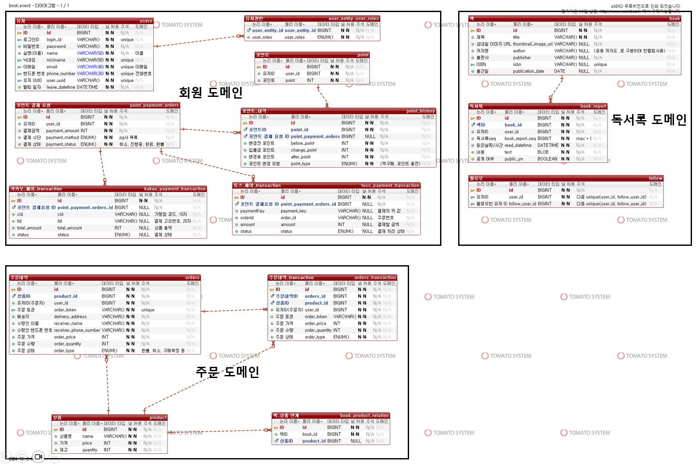

# 하루 한 페이지
독서록 서비스

하루 책 한페이지를 읽고 독서록을 작성하며 팔로우한 사람들의 독서록이 보인다.  
결제(포인트)를 충전하여 책을 구매할수있다.

## 프로젝트 기능 및 설계

- 회원 (회원AP)
  - 회원 가입  
    input : 비밀번호, 닉네임, 이메일, 핸드폰 번호, 이름, 로그인 ID  
    일반 사용자는 USER 권한을 가진다.
  - 회원 정보 수정  
    input : 비밀번호, 닉네임, 이메일, 핸드폰 번호
  - 로그인  
    JWT를 사용하여 로그인 구현
    

- 독서록 (독서록 AP)
  - 독서록 작성  
  input : 책, 읽은 날짜/시간, 내용, 공개/비공개 여부  
  책은 API를 이용하여 나온 책만 선택 가능하게 개발  
  API는 네이버 도서 open api 를 사용(https://developers.naver.com/docs/serviceapi/search/book/book.md)
  - 독서록 수정  
  input : 책, 읽은 날짜/시간, 내용, 공개/비공개 여부
  - 독서록 확인
    

- 팔로우 (독서록 AP)
  - 팔로우 기능  
    닉네임, ID 검색으로 팔로우
  - 언팔로우 기능
  - 팔로우 확인 기능
  - 팔로우한 게시글 확인  
    (인스타의 메인 화면처럼 팔로우한 사용자의 독서록이 나오도록 개발)
      
  
- 도서 상품(관리자 기능) (독서록 AP)
  - 도서 목록 추가 (외부 API)  
    관리자도 동일하게 네이버 API를 이용하여 도서 목록 추가  
    책 제목, 섬네일 이미지 url, 저자 이름, 판매가격, 출판사, ISBN, 출간일 DB에 저장  
    API는 네이버 도서 open api 를 사용(https://developers.naver.com/docs/serviceapi/search/book/book.md)
  - 도서 상품 관리 기능  
    (기초 정보를 바탕으로 수량, 품절 수정)
    

- 포인트 (주문 AP)
  - 포인트 충전  
    pg 사 연동대신 mock 처리
  - 포인트 충전 내역 확인
  - 포인트 확인
    

- 주문 (주문 AP)
  - 결제(주문)  
    input : 배송지, 수령인 핸드폰 번호, 이름  
    주문은 바로 결제 방식으로 장바구니는 따로 존재하지 않음  
    redis를 사용하여 동시성 문제 해결
  - 주문 내역 확인
  - 환불 기능  
    환불은 구매후 한달이내 가능
  - 주문 취소 기능  
    주문 취소는 결재 이후 1일 이내 가능
      

## ERD

## Trouble Shooting
[go to the trouble shooting section](doc/TROUBLE_SHOOTING.md)

### Tech Stack

 
   
   
   
  
  
  

